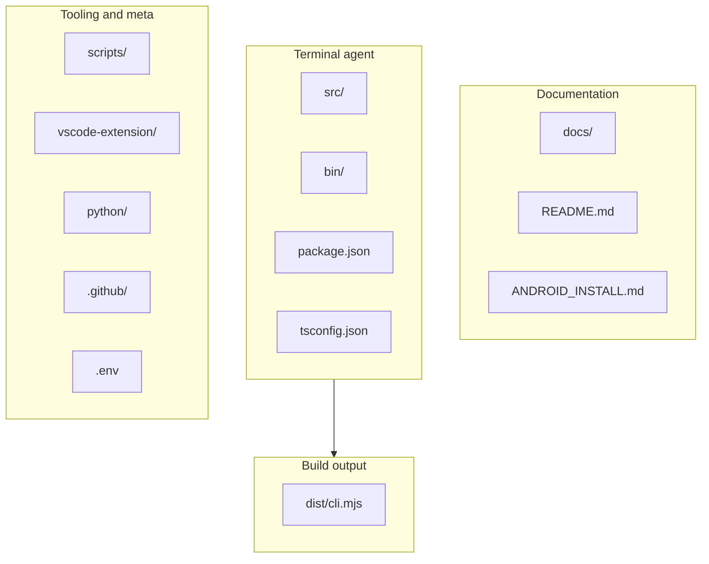
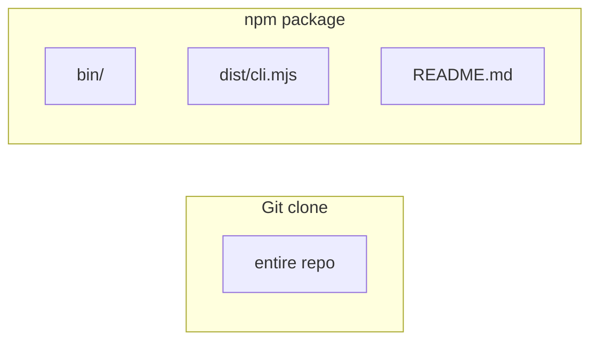

# 

> **[github.com/dxiv/dxa-deimos/](https://github.com/dxiv/dxa-deimos/)** · **[npm `@dxa-deimos/cli`](https://www.npmjs.com/package/@dxa-deimos/cli)** · **[Source @ dxiv/dxa-deimos](https://github.com/dxiv/dxa-deimos)**

**Deimos** takes its name from Mars’s outer moon—small, fast, and locked in orbit at the edge of the light. It is a **terminal-native** coding agent: one `deimos` command, **multi-model routing** across pluggable backends (Anthropic, OpenAI-compatible APIs, Gemini, GitHub Models, Ollama, Atomic Chat, and others), a full **tool** surface, **MCP**, slash commands, **agent orchestration**, and streaming sessions built for depth work. This repository ships the **CLI**, a **VS Code extension**, and a **dark terminal theme** forged for long runs in the shell.

**Link hub:** **[github.com/dxiv/dxa-deimos/](https://github.com/dxiv/dxa-deimos/)** is the canonical entry—npm, GitHub, and related surfaces in one place.

**License & marks:** [MIT](LICENSE). Third-party names and APIs appear only for interoperability and factual description. **[LEGAL.md](LEGAL.md)** sets out attribution, trademarks, and how to report concerns.

**Package:** [**@dxa-deimos/cli**](https://www.npmjs.com/package/@dxa-deimos/cli). **Source & issues:** **[github.com/dxiv/dxa-deimos](https://github.com/dxiv/dxa-deimos)**.

**Scope:** CLI, documentation, VS Code extension, and CI are maintained as a single product line.

**Tree:** `bin/`, `dist/cli.mjs`, `src/`, `vscode-extension/`, `docs/`, optional `python/`, `.github/` workflows, and root policy files—see [Repository structure](#repository-structure).

---

[](https://github.com/dxiv/dxa-deimos/actions/workflows/pr-checks.yml)
[](https://github.com/dxiv/dxa-deimos/discussions)
[](SECURITY.md)
[](https://badge.socket.dev/npm/package/@dxa-deimos/cli)
[](LICENSE)
[](https://www.npmjs.com/package/@dxa-deimos/cli)

[Quick start](#quick-start) · [How Deimos fits in](#how-deimos-fits-in) · [Setup](#setup-guides) · [Playbook](#local-agent-playbook-clone-developers) · [Providers](#supported-providers) · [Source build](#source-build-and-local-development) · [Repo layout](#repository-structure) · [VS Code](#vs-code-extension) · [Cheatsheet](docs/CHEATSHEET.md) · [Demo script](docs/DEMO.md) · [Contributing](#contributing) · [Security](#security) · [Privacy](#privacy--local-first) · [Community](#community)

**New to terminals or npm?** **[docs/non-technical-setup.md](docs/non-technical-setup.md)** → [Windows](docs/quick-start-windows.md) or [macOS / Linux](docs/quick-start-mac-linux.md) → **[checklist](docs/setup-checklist.md)** → **[first run](docs/first-run.md)**.
**All docs:** [docs/README.md](docs/README.md).

<p align="center">
  
</p>

---

## Why use it

- **One surface** for cloud APIs, local inference, and mixed routing—swap models without swapping tools
- **`/provider`** for guided setup, saved profiles, and reproducible environment
- **Bash**, file tools, **grep**/**glob**, **agents**, **tasks**, **MCP**, and web helpers—built for real repos, not demos
- **VS Code** integration and terminal theme from this repo when you want the editor and shell aligned

## How Deimos fits in

Deimos is **model-agnostic middleware**: one terminal workflow, tool surface, and MCP integration across **[supported providers](#supported-providers)**—change the backend without changing how you work in the repo.

| If you… | Deimos emphasizes… |
|--------|-------------------|
| Want **one CLI** for cloud APIs and **local** models (Ollama, LM Studio, etc.) | **Multi-model routing** and **`/provider`** profiles instead of a separate tool per vendor |
| Use **MCP**, skills, slash commands, or **automation** | **MCP**, skills, tasks, and **gRPC** headless mode in the **same** open codebase you can audit |
| Care about **defaults and transparency** | **Local credentials**, documented telemetry controls, and an automated **`verify:privacy`** check on shipped bundles ([Privacy](#privacy--local-first)) |

Other coding agents and IDEs can be excellent; this table is only to clarify **where Deimos optimizes**—portable, inspectable terminal depth work without locking daily use to a single vendor SDK.

---

## Quick start

You need **Node.js 22+** (see `engines` in `package.json`) and a terminal. If that’s new territory, use **[docs/non-technical-setup.md](docs/non-technical-setup.md)** first.

### Install

**npm:** [@dxa-deimos/cli](https://www.npmjs.com/package/@dxa-deimos/cli)

**GitHub Packages (GitHub org `dxa-dev`):** [dxa-dev / cli](https://github.com/orgs/dxa-dev/packages/npm/package/cli).

Use **npm** to install the published CLI. **[GitHub](https://github.com/dxiv/dxa-deimos)** is for source code, issues, and discussions—not a separate “installer” download.

```bash
npm install -g @dxa-deimos/cli
```

Install **[ripgrep](https://github.com/BurntSushi/ripgrep)** and ensure `rg` is on your `PATH`. If the CLI prints `ripgrep not found`, fix `PATH`, then open a **new** terminal window — [Troubleshooting](docs/troubleshooting.md) has more detail.

Provider and tuning flags in docs use **`DEIMOS_*`** names (for example `DEIMOS_USE_OPENAI=1`). See [docs/advanced-setup.md](docs/advanced-setup.md).

### Start

```bash
deimos
```

<p align="center">
  
</p>

Inside Deimos:

- run `/provider` for guided provider setup and saved profiles
- run `/onboard-github` for GitHub Models onboarding


### Fastest OpenAI setup

macOS / Linux:

```bash
export DEIMOS_USE_OPENAI=1
export OPENAI_API_KEY=sk-your-key-here
export OPENAI_MODEL=gpt-4o

deimos
```

Windows PowerShell:

```powershell
$env:DEIMOS_USE_OPENAI="1"
$env:OPENAI_API_KEY="sk-your-key-here"
$env:OPENAI_MODEL="gpt-4o"

deimos
```

### Fastest local Ollama setup

macOS / Linux:

```bash
export DEIMOS_USE_OPENAI=1
export OPENAI_BASE_URL=http://localhost:11434/v1
export OPENAI_MODEL=qwen2.5-coder:7b

deimos
```

Windows PowerShell:

```powershell
$env:DEIMOS_USE_OPENAI="1"
$env:OPENAI_BASE_URL="http://localhost:11434/v1"
$env:OPENAI_MODEL="qwen2.5-coder:7b"

deimos
```

---

## Setup guides

### Local agent playbook (clone developers)

Daily **local model** workflows from a **git clone** (profiles, diagnostics, command reference): **[PLAYBOOK.md](PLAYBOOK.md)**.

**Index:** [docs/README.md](docs/README.md) · **Checklist:** [docs/setup-checklist.md](docs/setup-checklist.md) · **After install:** [docs/first-run.md](docs/first-run.md) · **Problems:** [docs/troubleshooting.md](docs/troubleshooting.md)

Beginner-friendly:

- [Non-technical setup](docs/non-technical-setup.md)
- [Windows quick start](docs/quick-start-windows.md)
- [macOS / Linux quick start](docs/quick-start-mac-linux.md)

Advanced / source build:

- [Advanced setup](docs/advanced-setup.md) — Bun, profiles, `doctor:*`, env table
- [Local agent playbook](PLAYBOOK.md) — Ollama-focused workflow from a **git clone** (profiles, diagnostics, troubleshooting)
- **[.env.example](.env.example)** — template in git; copy to **`.env`** for a local clone, uncomment **one** provider block (see file header)
- [Android (Termux)](ANDROID_INSTALL.md) — build inside proot Ubuntu

**Optional:** [`python/`](python/) — small Python helpers for experiments; not required for normal CLI install ([`python/README.md`](python/README.md)).

---

## Supported providers

| Provider | Setup Path | Notes |
| --- | --- | --- |
| Anthropic (Deimos models) | `/provider` or env vars | Cloud default path; set `ANTHROPIC_API_KEY` in **`.env`** (layout in [.env.example](.env.example)) |
| OpenAI-compatible | `/provider` or env vars | OpenAI, OpenRouter, DeepSeek, Groq, Mistral, Together, Qwen (DashScope), Perplexity, LM Studio, Moonshot, and other `/v1`-compatible hosts |
| Gemini | `/provider` or env vars | Supports API key, access token, or local ADC workflow on current `main` |
| GitHub Models | `/onboard-github` | Interactive onboarding with saved credentials |
| Codex | `/provider` | Uses existing Codex credentials when available |
| Ollama | `/provider` or env vars | Local inference with no API key |
| Atomic Chat | advanced setup | Local Apple Silicon backend |
| Bedrock / Vertex / Foundry | env vars | Additional provider integrations for supported environments |

---

## What works

- **Tool-driven coding workflows**: Bash, file read/write/edit, grep, glob, agents, tasks, MCP, and slash commands
- **Streaming responses**: Real-time token output and tool progress
- **Tool calling**: Multi-step tool loops with model calls, tool execution, and follow-up responses
- **Images**: URL and base64 image inputs for providers that support vision
- **Provider profiles**: Guided setup plus saved `.deimos-profile.json` support
- **Local and remote model backends**: Cloud APIs, local servers, and Apple Silicon local inference

---

## Provider notes

Deimos supports multiple providers, but behaviour is not identical across all of them.

- Anthropic-specific features may not exist on other providers
- Tool quality depends heavily on the selected model
- Smaller local models can struggle with long multi-step tool flows
- Some providers impose lower output caps than the CLI defaults, and Deimos adapts where possible

For best results, use models with strong tool/function calling support.

---

## Agent routing

Deimos can route different agents to different models through settings-based routing. This is useful for cost optimisation or splitting work by model strength.

Add to `~/.deimos/settings.json`:

```json
{
  "agentModels": {
    "deepseek-chat": {
      "base_url": "https://api.deepseek.com/v1",
      "api_key": "sk-your-key"
    },
    "gpt-4o": {
      "base_url": "https://api.openai.com/v1",
      "api_key": "sk-your-key"
    }
  },
  "agentRouting": {
    "Explore": "deepseek-chat",
    "Plan": "gpt-4o",
    "general-purpose": "gpt-4o",
    "frontend-dev": "deepseek-chat",
    "default": "gpt-4o"
  }
}
```

When no routing match is found, the global provider remains the fallback.

`api_key` values in `settings.json` are plaintext. Don’t commit that file.

---

## Web search and fetch

By default, `WebSearch` works on non-Anthropic models using DuckDuckGo. This gives GPT-4o, DeepSeek, Gemini, Ollama, and other OpenAI-compatible providers a free web search path out of the box.

DuckDuckGo fallback scrapes search results; it can be rate-limited or blocked. For something sturdier, wire up Firecrawl below.

For Anthropic-native backends and Codex responses, Deimos keeps the native provider web search behaviour.

`WebFetch` works, but its basic HTTP plus HTML-to-markdown path can still fail on JavaScript-rendered sites or sites that block plain HTTP requests.

Set a [Firecrawl](https://firecrawl.dev) API key if you want Firecrawl-powered search/fetch behaviour:

```bash
export FIRECRAWL_API_KEY=your-key-here
```

With Firecrawl enabled:

- `WebSearch` can use Firecrawl's search API while DuckDuckGo remains the default free path when not using Anthropic’s first-party API
- `WebFetch` uses Firecrawl's scrape endpoint instead of raw HTTP, handling JS-rendered pages correctly

Free tier at [firecrawl.dev](https://firecrawl.dev) includes 500 credits. The key is optional.

---

## Headless gRPC server

Deimos can be run as a headless gRPC service, so you can integrate its agentic capabilities (tools, bash, file editing) into other applications, CI/CD pipelines, or custom user interfaces. The server uses bidirectional streaming to send real-time text chunks, tool calls, and request permissions for sensitive commands.

### Start the gRPC server

Start the core engine as a gRPC service on `localhost:50051`:

```bash
npm run dev:grpc
```

#### Configuration

| Variable | Default | Description |
| --- | --- | --- |
| `GRPC_PORT` | `50051` | Port the gRPC server listens on |
| `GRPC_HOST` | `localhost` | Bind address. Use `0.0.0.0` to expose on all interfaces (not recommended without authentication) |

### Run the test CLI client

We provide a lightweight CLI client that communicates exclusively over gRPC. It acts just like the main interactive CLI, rendering colors, streaming tokens, and prompting you for tool permissions (y/n) via the gRPC `action_required` event.

In a separate terminal, run:

```bash
npm run dev:grpc:cli
```

Note: the gRPC definitions live in `src/proto/deimos.proto`.

---

## Source build and local development

```bash
bun install
bun run build
node dist/cli.mjs
```

From a clone: create **`.env`** from [**`.env.example`**](.env.example), uncomment one provider block, put real values in **`.env`** (the example file header explains the fields).

**Bun** is what the repo scripts expect. Common commands:

- `bun run typecheck`
- `bun run dev`
- `bun test`
- `bun run test:coverage`
- `bun run security:pr-scan -- --base origin/main`
- `bun run smoke`
- `bun run doctor:runtime`
- `bun run verify:privacy`
- focused `bun test ...` for the areas you touch

**Tags:** pushing a `v*` tag runs [release artefacts](.github/workflows/release-artifacts.yml) (uploads `dist/cli.mjs` as a CI artefact). Maintainer checklist: [docs/maintainers.md](docs/maintainers.md).

---

## Testing and coverage

Tests use **Bun**’s built-in runner.

```bash
bun test
```

Coverage (writes `coverage/lcov.info` and a heatmap at `coverage/index.html`):

```bash
bun run test:coverage
```

Open the HTML report: macOS / Linux `open coverage/index.html` — Windows PowerShell: `start coverage/index.html`.

Rebuild only the coverage UI from an existing `lcov.info`:

```bash
bun run test:coverage:ui
```

Targeted runs:

- `bun run test:provider`
- `bun run test:provider-recommendation`
- `bun test path/to/file.test.ts`

Before opening a PR, a sensible smoke pass is `bun run build`, `bun run smoke`, then either focused `bun test …` on what you touched or `bun run test:coverage` if you changed shared runtime or provider code.

---

## Repository structure

The CLI is built from **`src/`** into **`dist/cli.mjs`**; **`bin/deimos.mjs`** is the published entrypoint npm calls. Everything else is documentation, build/CI tooling, the VS Code add-on, optional **`python/`** helpers, or policy files at the repo root — each path is described under **Paths** below.

**Layout**



**`.env`** is what you edit on your machine (gitignored). [**`.env.example`**](.env.example) is only the checked-in template — copy it to `.env` once, then change **`.env`**, not the example file.

**Clone vs npm install**

A full **git clone** matches the chart. **`npm install -g @dxa-deimos/cli`** ([npm package](https://www.npmjs.com/package/@dxa-deimos/cli)) only unpacks what `package.json` lists under `"files"` — right now `bin/`, `dist/cli.mjs`, and `README.md`.



### Paths

#### Documentation

- **`docs/`** — User guides: [index](docs/README.md), [checklist](docs/setup-checklist.md), [first run](docs/first-run.md), [cheatsheet](docs/CHEATSHEET.md), [demo script](docs/DEMO.md), [troubleshooting](docs/troubleshooting.md)
- **`ANDROID_INSTALL.md`** — Build inside Termux / proot Ubuntu
- **`README.md`** — Project overview (also included in the npm tarball)

#### Terminal agent

- **`src/`** — Core CLI and runtime (providers, tools, MCP, UI)
- **`bin/`** — `deimos.mjs` launcher (npm exposes the `deimos` command; runs `dist/cli.mjs` when built)
- **`package.json`** — Metadata, scripts, and the published [`files`](package.json) list
- **`tsconfig.json`** — TypeScript project for `src/`

#### Build and checks

- **`scripts/`** — Build pipeline, `doctor:*`, security scans, coverage helpers

#### Editor add-on

- **`vscode-extension/deimos-vscode/`** — VS Code integration and terminal theme ([extension readme](vscode-extension/deimos-vscode/README.md))

#### Optional

- **`python/`** — Optional utilities ([`python/README.md`](python/README.md)); not required for the CLI

#### Repository / CI

- **`.github/`** — [PR checks](.github/workflows/pr-checks.yml), `v*` [release artefacts](.github/workflows/release-artifacts.yml), Dependabot, issue/PR templates
- **`.env`** — Your provider keys when working from a clone (gitignored). Duplicate `.env.example` to `.env`, then edit **`.env`** only (`cp .env.example .env` on Unix; `Copy-Item .env.example .env` in PowerShell).
- **`.env.example`** — Reference template in the repo; do not put secrets here.
- **Root** — `CONTRIBUTING.md`, `CHANGELOG.md`, `LEGAL.md`, `LICENSE`, `SECURITY.md`

---

## VS Code extension

[`vscode-extension/deimos-vscode/`](vscode-extension/deimos-vscode/): launch the CLI from the editor, Control Centre in the activity bar, bundled terminal theme. [Extension readme](vscode-extension/deimos-vscode/README.md).

---

## Security

If you believe you found a security issue, see [SECURITY.md](SECURITY.md).

---

## Privacy & local-first

Provider credentials stay on your device in local config (for example `.env` and saved profiles); this project does not operate a central service that stores your keys by default.

`bun run verify:privacy` scans `dist/cli.mjs` for banned string patterns associated with third-party telemetry and similar endpoints. A passing run is not a guarantee that no data or secrets could ever leave your machine—it only enforces that guardrail on the built bundle.

Pattern list and logic: [`scripts/verify-no-phone-home.ts`](scripts/verify-no-phone-home.ts).

Telemetry-related environment variables include `DISABLE_TELEMETRY` and `DEIMOS_DISABLE_NONESSENTIAL_TRAFFIC` (stricter traffic limits). OpenTelemetry export is off unless `DEIMOS_ENABLE_TELEMETRY` is set to a truthy value.

---

## Community

- [Discussions](https://github.com/dxiv/dxa-deimos/discussions) — questions, ideas, general chat
- [Issues](https://github.com/dxiv/dxa-deimos/issues) — bugs and concrete feature requests

---

## Contributing

**[CONTRIBUTING.md](CONTRIBUTING.md)** covers clone, `bun install`, build, and what CI expects. For large or unclear scope, open an issue before sending a very large pull request.

---

## Legal / trademarks

**MIT** applies to material in this repository; dependencies have their own licenses. Third-party **names** appear only where **descriptive** (see [LEGAL.md](LEGAL.md)). Full license text: [LICENSE](LICENSE).

---

## Links

| Resource | URL |
| --- | --- |
| **Product page (link hub)** | [github.com/dxiv/dxa-deimos/](https://github.com/dxiv/dxa-deimos/) |
| **This package (npm)** | [`@dxa-deimos/cli`](https://www.npmjs.com/package/@dxa-deimos/cli) |
| **This package (GitHub Packages)** | [dxa-dev / cli](https://github.com/orgs/dxa-dev/packages/npm/package/cli) |
| **This repository** | [github.com/dxiv/dxa-deimos](https://github.com/dxiv/dxa-deimos) |
| **Discussions** | [GitHub Discussions](https://github.com/dxiv/dxa-deimos/discussions) |
| **Issues** | [GitHub Issues](https://github.com/dxiv/dxa-deimos/issues) |
| **Security** | [SECURITY.md](SECURITY.md) |
| **Legal / trademarks** | [LEGAL.md](LEGAL.md) |
| **Contributing** | [CONTRIBUTING.md](CONTRIBUTING.md) |
| **Docs index** | [docs/README.md](docs/README.md) |
| **License (MIT)** | [LICENSE](LICENSE) |
